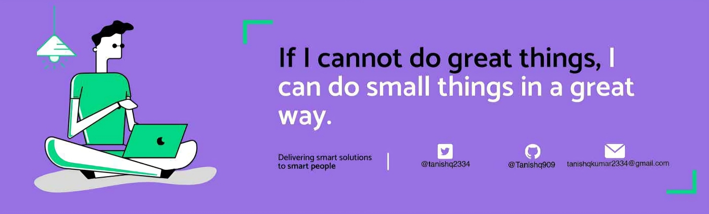

<h1 align="center">Hello  I'm Tanishq Kumar</h1>

  

 

## 👨🏻‍💻 About Me:

- 👋 Hey there! I'm a passionate developer diving deep into tech!  
- 🌱 **Currently learning:** `More Projects and DSA in C++`  
- 🔍 **Exploring:** `Creative Coding Projects` to make code fun 🎨  
- 👯 **Looking to collaborate** on `Innovative Web Development Projects` 👨‍💻  
- 🤔 **Open to advice on:** `Career Development` and `Advanced Coding`  
- 💬 **Ask me about anything!** (Except current affairs and general knowledge 😅)  
- ⚡ **Fun fact:** I bring code to life with animations! 🎉

 

## 🛠️ Technologies & Tools I Use:

  
  
  
  
  
  
  
  
  
  

 

## 🚀 My Goals for 2024:

- ✨ **Enhance My Coding Skills:** By building real-world projects 🛠️  
- 🧠 **Master Data Structures and Algorithms:** To ace coding challenges and competitions 💡  
- 👨‍💻 **Contribute to Open Source:** Give back to the community and learn collaboratively 🌍  
- 🎯 **Get Comfortable with Competitive Programming:** Practice makes perfect 🥇

 

## ❤️ Let's Connect:

  
  
  

 

## 🏆 GitHub Stats & Highlights:

  
  

 

## 🤝 Support Me:

If you enjoy my work or want to support my learning journey, consider buying me a coffee! ☕

 

## 🐍 Snake Animation:

To see my **Snake Animation**, check out the animated snake generated by GitHub Actions every 12 hours!

  

